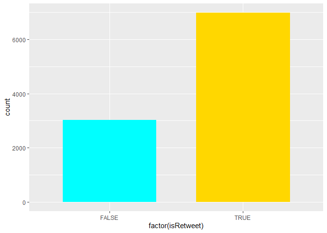
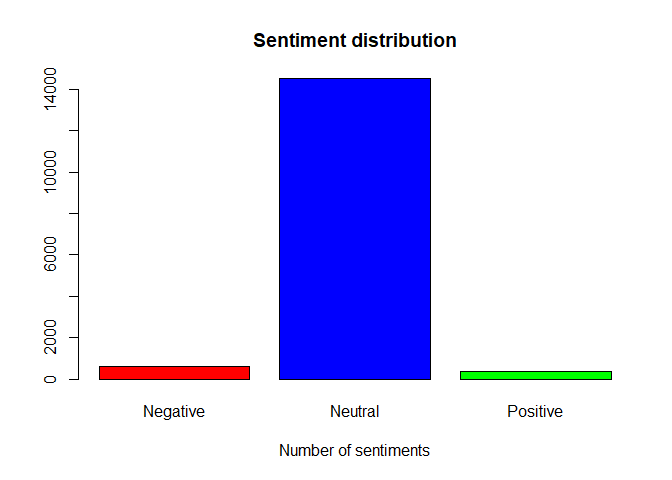
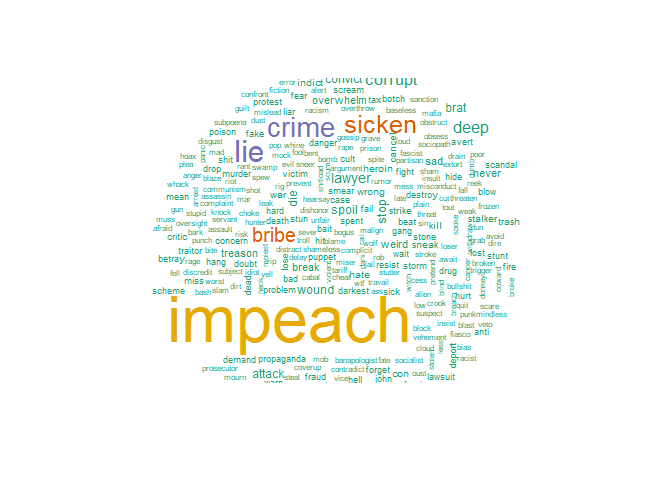
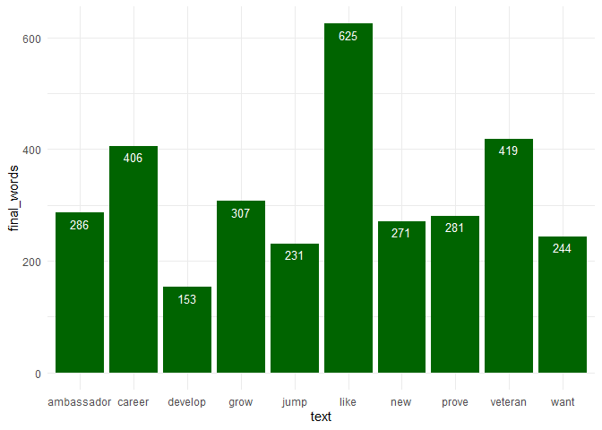
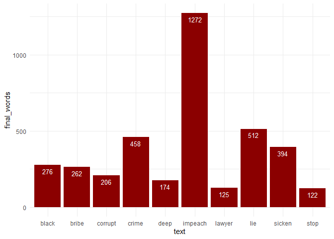
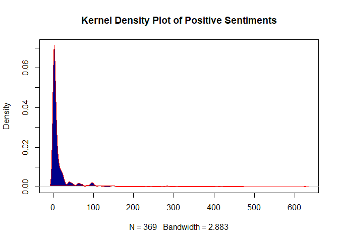
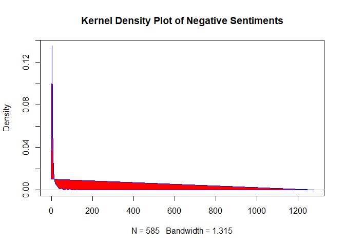

Set directory

```r
setwd("C:\\Users\\admin\\Desktop\\git hub\\twitter-sentiments")
```

Install / Load relevant packages

```r
if(!"pacman" %in% installed.packages()[,"Package"]) install.packages("pacman")
pacman::p_load(twitteR, ROAuth, dplyr, ggplot2, RColorBrewer,
               wordcloud, NLP, tm, SnowballC, RWeka, formattable, kableExtra, knitr,
               RSentiment, DT, sqldf, tidyverse)
```


Set up API authorization

```r
consumerKey="xxxxxxxxxxxxxxxxxxxxxxxxxxxxxxxxxxx"
consumerSecret="xxxxxxxxxxxxxxxxxxxxxxxxxxxxxxxxxxxxxxxxx"
accessToken="xxxxxxxxxxxxxxxxxxxxxxxxxxxxxxxxxxxxxxxxxxxxxxxx"
accessTokenSecret= "xxxxxxxxxxxxxxxxxxxxxxxxxxxxxxxxxxxxxxxxxxxxxx"
setup_twitter_oauth(consumerKey,consumerSecret,accessToken,accessTokenSecret)
```

Scrape tweets

```r
trump_tweets <- searchTwitter('#Trump', n=10000)
```

```r
convert the list of tweets to a dataframe
df <- twListToDF(trump_tweets)
```

order the dataframe

```r
df <- df[, order(names(df))]
```
format the date

```r
df$created <- strftime(df$created, '%Y-%m-%d')
```
save df as an R object

```r
save(df, file = "df.Rdata")
```
load the saved .RData file:

Data preprocessing: Let's start by removing any tweets by Trump himself from our data set

```r
df<-sqldf("select * from df where screenName not in ('realDonaldTrump' and 'POTUS')")
```
A glance at the data dataset

```r
glimpse(df)
```
Let's see the distribution of retweets

```r
ggplot(df,aes(x=factor(isRetweet)))+
  geom_bar(stat = "count", width = 0.7, fill = c("cyan", "gold")) 
```

<!-- -->

find unique tweets

```r
unique_tweets<-distinct(df, text, .keep_all = TRUE)
```
find the top_10 trending tweets

```r
trending_tweets<-top_n(unique_tweets, 10, retweetCount)
```
Let's remove the special characters

```r
removeSpecialChars <- function(x) gsub("@\\w+RT\nRT://w/\n", " ", x)
```

```r
trending_tweets$text <- sapply(trending_tweets$text, removeSpecialChars)
```

```r
print(trending_tweets$text)
```
extract relevant data

```r
my_text <- as.character(df$text)
```
Further data cleaning, creation of a corpus and extration of the relevant words

```r
set.seed(100)
sample <- sample(my_text, (length(my_text)))
corpus <- Corpus(VectorSource(list(sample)))
corpus <- tm_map(corpus, removePunctuation)
corpus <- tm_map(corpus, content_transformer(tolower))
corpus <- tm_map(corpus, removeNumbers)
corpus <- tm_map(corpus, stripWhitespace)
corpus <- tm_map(corpus, removeWords, stopwords('english'))
corpus <- tm_map(corpus, stemDocument)
dt_matrix <- DocumentTermMatrix(VCorpus(VectorSource(corpus[[1]]$content)))
final_words <- colSums(as.matrix(dt_matrix))
```
Calculate Sentiments

```r
cal_sentiments <- calculate_sentiment(names(final_words))
```
Add final_words column

```r
cal_sentiments <- cbind(cal_sentiments, as.data.frame(final_words))
```
Find the top_10 tokenized words used to refer to Trump on twitter

```r
cal_sentiments %>%
  select(text, sentiment, final_words) %>%
  arrange() %>%
  top_n(10,final_words) %>%
  mutate(final_words = color_tile("lightblue","lightblue")(final_words)) %>%
  mutate(text = color_tile("lightgreen","lightgreen")(text)) %>%
  kable("html", escape = FALSE, align = "c", caption = "Tokenized Format Example") %>%
  kable_styling(bootstrap_options =
                  c("striped", "condensed", "bordered"),
                full_width = FALSE)
```

<table class="table table-striped table-condensed table-bordered" style="width: auto !important; margin-left: auto; margin-right: auto;">
<caption>Tokenized Format Example</caption>
 <thead>
  <tr>
   <th style="text-align:center;"> text </th>
   <th style="text-align:center;"> sentiment </th>
   <th style="text-align:center;"> final_words </th>
  </tr>
 </thead>
<tbody>
  <tr>
   <td style="text-align:center;"> <span style="display: block; padding: 0 4px; border-radius: 4px; background-color: #90ee90">amp            </span> </td>
   <td style="text-align:center;"> Neutral </td>
   <td style="text-align:center;"> <span style="display: block; padding: 0 4px; border-radius: 4px; background-color: #add8e6">996</span> </td>
  </tr>
  <tr>
   <td style="text-align:center;"> <span style="display: block; padding: 0 4px; border-radius: 4px; background-color: #90ee90">andyostroy     </span> </td>
   <td style="text-align:center;"> Neutral </td>
   <td style="text-align:center;"> <span style="display: block; padding: 0 4px; border-radius: 4px; background-color: #add8e6">828</span> </td>
  </tr>
  <tr>
   <td style="text-align:center;"> <span style="display: block; padding: 0 4px; border-radius: 4px; background-color: #90ee90">gop            </span> </td>
   <td style="text-align:center;"> Neutral </td>
   <td style="text-align:center;"> <span style="display: block; padding: 0 4px; border-radius: 4px; background-color: #add8e6">963</span> </td>
  </tr>
  <tr>
   <td style="text-align:center;"> <span style="display: block; padding: 0 4px; border-radius: 4px; background-color: #90ee90">impeach        </span> </td>
   <td style="text-align:center;"> Negative </td>
   <td style="text-align:center;"> <span style="display: block; padding: 0 4px; border-radius: 4px; background-color: #add8e6">1272</span> </td>
  </tr>
  <tr>
   <td style="text-align:center;"> <span style="display: block; padding: 0 4px; border-radius: 4px; background-color: #90ee90">just           </span> </td>
   <td style="text-align:center;"> Neutral </td>
   <td style="text-align:center;"> <span style="display: block; padding: 0 4px; border-radius: 4px; background-color: #add8e6">620</span> </td>
  </tr>
  <tr>
   <td style="text-align:center;"> <span style="display: block; padding: 0 4px; border-radius: 4px; background-color: #90ee90">like           </span> </td>
   <td style="text-align:center;"> Positive </td>
   <td style="text-align:center;"> <span style="display: block; padding: 0 4px; border-radius: 4px; background-color: #add8e6">625</span> </td>
  </tr>
  <tr>
   <td style="text-align:center;"> <span style="display: block; padding: 0 4px; border-radius: 4px; background-color: #90ee90">realdonaldtrump</span> </td>
   <td style="text-align:center;"> Neutral </td>
   <td style="text-align:center;"> <span style="display: block; padding: 0 4px; border-radius: 4px; background-color: #add8e6">1090</span> </td>
  </tr>
  <tr>
   <td style="text-align:center;"> <span style="display: block; padding: 0 4px; border-radius: 4px; background-color: #90ee90">senat          </span> </td>
   <td style="text-align:center;"> Neutral </td>
   <td style="text-align:center;"> <span style="display: block; padding: 0 4px; border-radius: 4px; background-color: #add8e6">801</span> </td>
  </tr>
  <tr>
   <td style="text-align:center;"> <span style="display: block; padding: 0 4px; border-radius: 4px; background-color: #90ee90">trump          </span> </td>
   <td style="text-align:center;"> Neutral </td>
   <td style="text-align:center;"> <span style="display: block; padding: 0 4px; border-radius: 4px; background-color: #add8e6">5438</span> </td>
  </tr>
  <tr>
   <td style="text-align:center;"> <span style="display: block; padding: 0 4px; border-radius: 4px; background-color: #90ee90">will           </span> </td>
   <td style="text-align:center;"> Neutral </td>
   <td style="text-align:center;"> <span style="display: block; padding: 0 4px; border-radius: 4px; background-color: #add8e6">742</span> </td>
  </tr>
</tbody>
</table>

Show distribution of the sentiments

```r
count<-table(cal_sentiments$sentiment)
barplot(count, main="Sentiment distribution",
        xlab="Number of sentiments", col = c("red", "blue", "green"))
```

<!-- -->

Top_10 positive words used

```r
cal_sentiments %>%
  filter(sentiment=="Positive") %>%
  select(text, sentiment, final_words) %>%
  arrange() %>%
  top_n(10,final_words) %>%
  mutate(final_words = color_tile("lightblue","lightblue")(final_words)) %>%
  mutate(text = color_tile("lightgreen","lightgreen")(text)) %>%
  kable("html", escape = FALSE, align = "c", caption = "Top_10 Tokenized Positive Words") %>%
  kable_styling(bootstrap_options =
                  c("striped", "condensed", "bordered"),
                full_width = FALSE)
```

<table class="table table-striped table-condensed table-bordered" style="width: auto !important; margin-left: auto; margin-right: auto;">
<caption>Top_10 Tokenized Positive Words</caption>
 <thead>
  <tr>
   <th style="text-align:center;"> text </th>
   <th style="text-align:center;"> sentiment </th>
   <th style="text-align:center;"> final_words </th>
  </tr>
 </thead>
<tbody>
  <tr>
   <td style="text-align:center;"> <span style="display: block; padding: 0 4px; border-radius: 4px; background-color: #90ee90">ambassador</span> </td>
   <td style="text-align:center;"> Positive </td>
   <td style="text-align:center;"> <span style="display: block; padding: 0 4px; border-radius: 4px; background-color: #add8e6">286</span> </td>
  </tr>
  <tr>
   <td style="text-align:center;"> <span style="display: block; padding: 0 4px; border-radius: 4px; background-color: #90ee90">career    </span> </td>
   <td style="text-align:center;"> Positive </td>
   <td style="text-align:center;"> <span style="display: block; padding: 0 4px; border-radius: 4px; background-color: #add8e6">406</span> </td>
  </tr>
  <tr>
   <td style="text-align:center;"> <span style="display: block; padding: 0 4px; border-radius: 4px; background-color: #90ee90">develop   </span> </td>
   <td style="text-align:center;"> Positive </td>
   <td style="text-align:center;"> <span style="display: block; padding: 0 4px; border-radius: 4px; background-color: #add8e6">153</span> </td>
  </tr>
  <tr>
   <td style="text-align:center;"> <span style="display: block; padding: 0 4px; border-radius: 4px; background-color: #90ee90">grow      </span> </td>
   <td style="text-align:center;"> Positive </td>
   <td style="text-align:center;"> <span style="display: block; padding: 0 4px; border-radius: 4px; background-color: #add8e6">307</span> </td>
  </tr>
  <tr>
   <td style="text-align:center;"> <span style="display: block; padding: 0 4px; border-radius: 4px; background-color: #90ee90">jump      </span> </td>
   <td style="text-align:center;"> Positive </td>
   <td style="text-align:center;"> <span style="display: block; padding: 0 4px; border-radius: 4px; background-color: #add8e6">231</span> </td>
  </tr>
  <tr>
   <td style="text-align:center;"> <span style="display: block; padding: 0 4px; border-radius: 4px; background-color: #90ee90">like      </span> </td>
   <td style="text-align:center;"> Positive </td>
   <td style="text-align:center;"> <span style="display: block; padding: 0 4px; border-radius: 4px; background-color: #add8e6">625</span> </td>
  </tr>
  <tr>
   <td style="text-align:center;"> <span style="display: block; padding: 0 4px; border-radius: 4px; background-color: #90ee90">new       </span> </td>
   <td style="text-align:center;"> Positive </td>
   <td style="text-align:center;"> <span style="display: block; padding: 0 4px; border-radius: 4px; background-color: #add8e6">271</span> </td>
  </tr>
  <tr>
   <td style="text-align:center;"> <span style="display: block; padding: 0 4px; border-radius: 4px; background-color: #90ee90">prove     </span> </td>
   <td style="text-align:center;"> Positive </td>
   <td style="text-align:center;"> <span style="display: block; padding: 0 4px; border-radius: 4px; background-color: #add8e6">281</span> </td>
  </tr>
  <tr>
   <td style="text-align:center;"> <span style="display: block; padding: 0 4px; border-radius: 4px; background-color: #90ee90">veteran   </span> </td>
   <td style="text-align:center;"> Positive </td>
   <td style="text-align:center;"> <span style="display: block; padding: 0 4px; border-radius: 4px; background-color: #add8e6">419</span> </td>
  </tr>
  <tr>
   <td style="text-align:center;"> <span style="display: block; padding: 0 4px; border-radius: 4px; background-color: #90ee90">want      </span> </td>
   <td style="text-align:center;"> Positive </td>
   <td style="text-align:center;"> <span style="display: block; padding: 0 4px; border-radius: 4px; background-color: #add8e6">244</span> </td>
  </tr>
</tbody>
</table>


Top 10 negative words used against Trump

```r
cal_sentiments %>%
  filter(sentiment=="Negative") %>%
  select(text, sentiment, final_words) %>%
  arrange() %>%
  top_n(10,final_words) %>%
  mutate(final_words = color_tile("lightblue","lightblue")(final_words)) %>%
  mutate(text = color_tile("lightgreen","lightgreen")(text)) %>%
  kable("html", escape = FALSE, align = "c", caption = "Tokenized Format Example") %>%
  kable_styling(bootstrap_options =
                  c("striped", "condensed", "bordered"),
                full_width = FALSE)
```

<table class="table table-striped table-condensed table-bordered" style="width: auto !important; margin-left: auto; margin-right: auto;">
<caption>Tokenized Format Example</caption>
 <thead>
  <tr>
   <th style="text-align:center;"> text </th>
   <th style="text-align:center;"> sentiment </th>
   <th style="text-align:center;"> final_words </th>
  </tr>
 </thead>
<tbody>
  <tr>
   <td style="text-align:center;"> <span style="display: block; padding: 0 4px; border-radius: 4px; background-color: #90ee90">black  </span> </td>
   <td style="text-align:center;"> Negative </td>
   <td style="text-align:center;"> <span style="display: block; padding: 0 4px; border-radius: 4px; background-color: #add8e6">276</span> </td>
  </tr>
  <tr>
   <td style="text-align:center;"> <span style="display: block; padding: 0 4px; border-radius: 4px; background-color: #90ee90">bribe  </span> </td>
   <td style="text-align:center;"> Negative </td>
   <td style="text-align:center;"> <span style="display: block; padding: 0 4px; border-radius: 4px; background-color: #add8e6">262</span> </td>
  </tr>
  <tr>
   <td style="text-align:center;"> <span style="display: block; padding: 0 4px; border-radius: 4px; background-color: #90ee90">corrupt</span> </td>
   <td style="text-align:center;"> Negative </td>
   <td style="text-align:center;"> <span style="display: block; padding: 0 4px; border-radius: 4px; background-color: #add8e6">206</span> </td>
  </tr>
  <tr>
   <td style="text-align:center;"> <span style="display: block; padding: 0 4px; border-radius: 4px; background-color: #90ee90">crime  </span> </td>
   <td style="text-align:center;"> Negative </td>
   <td style="text-align:center;"> <span style="display: block; padding: 0 4px; border-radius: 4px; background-color: #add8e6">458</span> </td>
  </tr>
  <tr>
   <td style="text-align:center;"> <span style="display: block; padding: 0 4px; border-radius: 4px; background-color: #90ee90">deep   </span> </td>
   <td style="text-align:center;"> Negative </td>
   <td style="text-align:center;"> <span style="display: block; padding: 0 4px; border-radius: 4px; background-color: #add8e6">174</span> </td>
  </tr>
  <tr>
   <td style="text-align:center;"> <span style="display: block; padding: 0 4px; border-radius: 4px; background-color: #90ee90">impeach</span> </td>
   <td style="text-align:center;"> Negative </td>
   <td style="text-align:center;"> <span style="display: block; padding: 0 4px; border-radius: 4px; background-color: #add8e6">1272</span> </td>
  </tr>
  <tr>
   <td style="text-align:center;"> <span style="display: block; padding: 0 4px; border-radius: 4px; background-color: #90ee90">lawyer </span> </td>
   <td style="text-align:center;"> Negative </td>
   <td style="text-align:center;"> <span style="display: block; padding: 0 4px; border-radius: 4px; background-color: #add8e6">125</span> </td>
  </tr>
  <tr>
   <td style="text-align:center;"> <span style="display: block; padding: 0 4px; border-radius: 4px; background-color: #90ee90">lie    </span> </td>
   <td style="text-align:center;"> Negative </td>
   <td style="text-align:center;"> <span style="display: block; padding: 0 4px; border-radius: 4px; background-color: #add8e6">512</span> </td>
  </tr>
  <tr>
   <td style="text-align:center;"> <span style="display: block; padding: 0 4px; border-radius: 4px; background-color: #90ee90">sicken </span> </td>
   <td style="text-align:center;"> Negative </td>
   <td style="text-align:center;"> <span style="display: block; padding: 0 4px; border-radius: 4px; background-color: #add8e6">394</span> </td>
  </tr>
  <tr>
   <td style="text-align:center;"> <span style="display: block; padding: 0 4px; border-radius: 4px; background-color: #90ee90">stop   </span> </td>
   <td style="text-align:center;"> Negative </td>
   <td style="text-align:center;"> <span style="display: block; padding: 0 4px; border-radius: 4px; background-color: #add8e6">122</span> </td>
  </tr>
</tbody>
</table>

Sentiment Analysis

```r
pos_sent<-cal_sentiments[cal_sentiments$sentiment == 'Positive',]
neg_sent<-cal_sentiments[cal_sentiments$sentiment == 'Negative',]
neut_sent<-cal_sentiments[cal_sentiments$sentiment == 'Neutral',]
```
Positive sentiments

```r
DT::datatable(pos_sent)
```

<!--html_preserve--><div id="htmlwidget-f3e587d444907043d651" style="width:100%;height:auto;" class="datatables html-widget"></div>
<script type="application/json" data-for="htmlwidget-f3e587d444907043d651">{"x":{"filter":"none","data":[["accept","accomplish","accord","acrobat","action","actual","adjust","afford","agreement","ahead","aid","allow","ambassador","ancestor","anchor","applaud","apt","art","artist","asset","assist","astound","attract","august","aura","author","awaken","ballot","banquet","bargain","benefit","best","better","big","birthday","bless","bolster","bonus","boost","brave","breakfast","brilliant","brother","build","cabinet","calm","candid","capitalist","care","career","carol","cash","center","certain","chairman","chant","charm","child","church","circus","citizen","civil","clean","clear","clown","colonel","commend","comprehend","constant","contact","core","correct","counsel","count","craft","cream","credit","crystal","daughter","deal","dear","decent","deed","defend","delight","develop","devout","dinner","director","doctor","dolphin","don","dream","eager","earn","eat","effort","elect","enjoy","enthusiasm","environ","epic","excel","expand","expect","expert","explain","extra","fair","faith","familiar","famous","fan","fast","faster","favor","fearless","feat","fine","fit","flow","focus","food","forward","found","founder","frank","free","freedom","friend","full","fun","fusion","gain","garden","general","genius","glad","global","god","gold","good","govern","grace","grand","grandchildren","grant","great","greatest","green","greet","grow","growth","guardian","haha","hale","heaven","help","hero","highlight","hire","homeland","honest","honor","hope","huge","humanitarian","humor","hymn","idol","important","impress","inspector","instruct","interest","jesus","job","join","journalist","jump","keen","ken","kind","king","kiss","lamb","land","laud","laugh","laughter","lead","leader","learn","led","legal","level","like","linguist","lmao","love","lucid","magnet","main","major","march","marvel","mate","matter","mayor","medal","merit","model","modern","money","monument","moral","most","music","mutual","new","nice","oath","obvious","offer","option","outsmart","ownership","pardon","partner","pastor","patriot","perfect","perk","pick","pilot","pleasant","pool","pope","popular","pray","precious","prefer","premier","present","president","prevail","pride","prime","prize","progress","prompt","proper","protect","protector","proud","prove","proven","public","pull","pure","question","quick","rapport","reach","reader","real","reason","recommend","redeem","regard","respect","rest","revel","rich","richer","rider","right","righteous","robust","rock","rofl","sane","save","savior","scholarship","scientist","sea","seal","sermon","sex","share","sharp","silent","sing","sir","sky","slate","smart","smarter","soldier","solid","spark","special","speech","spirit","standout","star","statement","status","staunch","straight","strength","strong","strongest","success","succinct","sunset","super","support","surpass","sweet","tale","talent","talk","thank","thrill","top","tower","tree","trend","triumph","true","trust","truth","upbeat","usher","usual","utmost","vanguard","velvet","veteran","victor","visit","vital","voter","vow","want","wealth","well","white","win","winner","wisdom","wise","wish","wit","withstand","won","wonder","word","work","worship","worth","wow","writer","yeah","yes","young","youth"],["accept","accomplish","accord","acrobat","action","actual","adjust","afford","agreement","ahead","aid","allow","ambassador","ancestor","anchor","applaud","apt","art","artist","asset","assist","astound","attract","august","aura","author","awaken","ballot","banquet","bargain","benefit","best","better","big","birthday","bless","bolster","bonus","boost","brave","breakfast","brilliant","brother","build","cabinet","calm","candid","capitalist","care","career","carol","cash","center","certain","chairman","chant","charm","child","church","circus","citizen","civil","clean","clear","clown","colonel","commend","comprehend","constant","contact","core","correct","counsel","count","craft","cream","credit","crystal","daughter","deal","dear","decent","deed","defend","delight","develop","devout","dinner","director","doctor","dolphin","don","dream","eager","earn","eat","effort","elect","enjoy","enthusiasm","environ","epic","excel","expand","expect","expert","explain","extra","fair","faith","familiar","famous","fan","fast","faster","favor","fearless","feat","fine","fit","flow","focus","food","forward","found","founder","frank","free","freedom","friend","full","fun","fusion","gain","garden","general","genius","glad","global","god","gold","good","govern","grace","grand","grandchildren","grant","great","greatest","green","greet","grow","growth","guardian","haha","hale","heaven","help","hero","highlight","hire","homeland","honest","honor","hope","huge","humanitarian","humor","hymn","idol","important","impress","inspector","instruct","interest","jesus","job","join","journalist","jump","keen","ken","kind","king","kiss","lamb","land","laud","laugh","laughter","lead","leader","learn","led","legal","level","like","linguist","lmao","love","lucid","magnet","main","major","march","marvel","mate","matter","mayor","medal","merit","model","modern","money","monument","moral","most","music","mutual","new","nice","oath","obvious","offer","option","outsmart","ownership","pardon","partner","pastor","patriot","perfect","perk","pick","pilot","pleasant","pool","pope","popular","pray","precious","prefer","premier","present","president","prevail","pride","prime","prize","progress","prompt","proper","protect","protector","proud","prove","proven","public","pull","pure","question","quick","rapport","reach","reader","real","reason","recommend","redeem","regard","respect","rest","revel","rich","richer","rider","right","righteous","robust","rock","rofl","sane","save","savior","scholarship","scientist","sea","seal","sermon","sex","share","sharp","silent","sing","sir","sky","slate","smart","smarter","soldier","solid","spark","special","speech","spirit","standout","star","statement","status","staunch","straight","strength","strong","strongest","success","succinct","sunset","super","support","surpass","sweet","tale","talent","talk","thank","thrill","top","tower","tree","trend","triumph","true","trust","truth","upbeat","usher","usual","utmost","vanguard","velvet","veteran","victor","visit","vital","voter","vow","want","wealth","well","white","win","winner","wisdom","wise","wish","wit","withstand","won","wonder","word","work","worship","worth","wow","writer","yeah","yes","young","youth"],["Positive","Positive","Positive","Positive","Positive","Positive","Positive","Positive","Positive","Positive","Positive","Positive","Positive","Positive","Positive","Positive","Positive","Positive","Positive","Positive","Positive","Positive","Positive","Positive","Positive","Positive","Positive","Positive","Positive","Positive","Positive","Positive","Positive","Positive","Positive","Positive","Positive","Positive","Positive","Positive","Positive","Positive","Positive","Positive","Positive","Positive","Positive","Positive","Positive","Positive","Positive","Positive","Positive","Positive","Positive","Positive","Positive","Positive","Positive","Positive","Positive","Positive","Positive","Positive","Positive","Positive","Positive","Positive","Positive","Positive","Positive","Positive","Positive","Positive","Positive","Positive","Positive","Positive","Positive","Positive","Positive","Positive","Positive","Positive","Positive","Positive","Positive","Positive","Positive","Positive","Positive","Positive","Positive","Positive","Positive","Positive","Positive","Positive","Positive","Positive","Positive","Positive","Positive","Positive","Positive","Positive","Positive","Positive","Positive","Positive","Positive","Positive","Positive","Positive","Positive","Positive","Positive","Positive","Positive","Positive","Positive","Positive","Positive","Positive","Positive","Positive","Positive","Positive","Positive","Positive","Positive","Positive","Positive","Positive","Positive","Positive","Positive","Positive","Positive","Positive","Positive","Positive","Positive","Positive","Positive","Positive","Positive","Positive","Positive","Positive","Positive","Positive","Positive","Positive","Positive","Positive","Positive","Positive","Positive","Positive","Positive","Positive","Positive","Positive","Positive","Positive","Positive","Positive","Positive","Positive","Positive","Positive","Positive","Positive","Positive","Positive","Positive","Positive","Positive","Positive","Positive","Positive","Positive","Positive","Positive","Positive","Positive","Positive","Positive","Positive","Positive","Positive","Positive","Positive","Positive","Positive","Positive","Positive","Positive","Positive","Positive","Positive","Positive","Positive","Positive","Positive","Positive","Positive","Positive","Positive","Positive","Positive","Positive","Positive","Positive","Positive","Positive","Positive","Positive","Positive","Positive","Positive","Positive","Positive","Positive","Positive","Positive","Positive","Positive","Positive","Positive","Positive","Positive","Positive","Positive","Positive","Positive","Positive","Positive","Positive","Positive","Positive","Positive","Positive","Positive","Positive","Positive","Positive","Positive","Positive","Positive","Positive","Positive","Positive","Positive","Positive","Positive","Positive","Positive","Positive","Positive","Positive","Positive","Positive","Positive","Positive","Positive","Positive","Positive","Positive","Positive","Positive","Positive","Positive","Positive","Positive","Positive","Positive","Positive","Positive","Positive","Positive","Positive","Positive","Positive","Positive","Positive","Positive","Positive","Positive","Positive","Positive","Positive","Positive","Positive","Positive","Positive","Positive","Positive","Positive","Positive","Positive","Positive","Positive","Positive","Positive","Positive","Positive","Positive","Positive","Positive","Positive","Positive","Positive","Positive","Positive","Positive","Positive","Positive","Positive","Positive","Positive","Positive","Positive","Positive","Positive","Positive","Positive","Positive","Positive","Positive","Positive","Positive","Positive","Positive","Positive","Positive","Positive","Positive","Positive","Positive","Positive","Positive","Positive","Positive","Positive","Positive","Positive","Positive","Positive","Positive","Positive","Positive","Positive","Positive","Positive","Positive","Positive","Positive","Positive","Positive","Positive","Positive","Positive","Positive","Positive","Positive","Positive","Positive"],[7,3,8,4,34,20,2,1,7,7,58,22,286,1,2,1,1,4,1,6,2,1,1,1,4,9,1,1,1,2,6,17,25,124,2,10,1,1,4,2,1,5,3,16,1,4,6,1,46,406,1,4,2,4,36,2,1,11,6,40,9,2,16,60,9,1,1,2,3,2,1,6,6,3,1,1,3,1,4,105,51,1,1,66,1,153,1,12,1,6,12,4,1,1,4,1,5,97,16,1,3,1,1,3,19,5,17,1,94,7,3,1,11,7,4,5,2,2,3,16,1,7,1,22,11,4,3,43,7,113,22,1,2,5,1,8,4,6,9,21,15,41,49,1,5,2,15,83,4,1,3,307,3,3,3,1,2,117,12,3,18,2,27,15,19,98,2,6,1,1,4,1,1,2,21,9,45,22,39,231,2,1,10,9,1,2,14,1,3,3,22,47,3,6,24,20,625,1,1,102,4,2,6,8,5,1,8,16,8,2,2,9,2,101,2,15,5,39,3,271,4,65,11,17,2,1,1,21,6,4,95,11,1,4,11,1,3,1,1,6,1,3,3,6,14,1,2,6,2,7,1,1,145,1,13,281,2,71,22,5,70,4,6,2,1,30,25,2,1,6,41,8,5,97,1,7,149,13,1,1,1,6,7,1,1,1,1,17,1,7,10,1,6,2,2,3,1,3,5,8,1,1,6,6,2,1,8,29,2,1,24,4,27,1,4,12,1,1,74,1,3,1,1,97,39,12,28,1,2,6,1,12,8,61,1,1,5,1,1,12,419,1,64,2,14,14,244,1,63,84,52,10,4,1,11,91,1,1,23,23,89,72,7,9,2,20,26,7,1]],"container":"<table class=\"display\">\n  <thead>\n    <tr>\n      <th> <\/th>\n      <th>text<\/th>\n      <th>sentiment<\/th>\n      <th>final_words<\/th>\n    <\/tr>\n  <\/thead>\n<\/table>","options":{"columnDefs":[{"className":"dt-right","targets":3},{"orderable":false,"targets":0}],"order":[],"autoWidth":false,"orderClasses":false}},"evals":[],"jsHooks":[]}</script><!--/html_preserve-->

Wordcloud of positive words with freq of at least 10

```r
layout(matrix(c(1, 2), nrow=2), heights=c(1, 4))
par(mar=rep(0, 4))
plot.new()
set.seed(100)
wordcloud(pos_sent$text,pos_sent$final_words,min.final_words=10,colors=brewer.pal(6,"Dark2"))
```

<!-- -->

Negative Sentiments

```r
DT::datatable(neg_sent)
```

<!--html_preserve--><div id="htmlwidget-fcd8a605824ac1ca60cd" style="width:100%;height:auto;" class="datatables html-widget"></div>
<script type="application/json" data-for="htmlwidget-fcd8a605824ac1ca60cd">{"x":{"filter":"none","data":[["abandon","abject","abort","accident","addict","affront","afraid","ail","alert","alien","alter","anathema","anger","angst","anti","antichrist","apologist","appal","argument","arrest","ass","assassin","assault","asylum","attack","authoritarian","autocrat","avert","avoid","await","awkward","bad","bailout","bait","ban","bankrupt","bark","barrier","baseless","bash","beast","beat","beg","bent","betray","bias","bier","bigot","bitch","bite","bitter","blab","black","blackmail","blame","blanch","blast","blatant","blaze","bleed","blind","block","blow","blunder","bogus","boil","bomb","bore","botch","bother","bottom","brag","brainwash","brat","breach","break","breakdown","bribe","broke","broken","bullshit","bureaucrat","bust","butt","cabal","cage","cancel","cancer","cartel","case","casino","cess","cheap","cheat","chicken","choke","clash","cloud","combat","communism","communist","complain","complaint","complicit","con","conceal","concern","condemn","conflict","confront","contempt","contend","contradict","convict","corrupt","coverup","coward","crack","crackpot","crap","crash","crass","crazier","crime","critic","crook","cross","cruel","crush","cuckoo","cult","cut","damn","danger","dark","darkest","dead","death","debt","deep","default","defect","defer","defraud","delay","delusion","demand","demon","denial","denier","deport","depress","destroy","deter","detest","devil","dice","die","diet","difficult","dire","dirt","disappoint","disarm","discredit","disdain","disgust","dishonest","dishonor","dismay","dispel","disrespect","diss","distract","disturb","donkey","doubt","douchebag","drain","drama","drop","drown","drug","drunk","dumb","dumber","dump","dun","dupe","dust","ego","embarrass","encroach","engulf","error","erupt","evil","excess","exempt","explicit","exploit","extinct","extinguish","extort","fail","faint","fake","fall","fallen","falsehood","fascist","fat","fate","faze","fear","feckless","fee","fell","fiasco","fiction","fight","figurehead","fire","flagrant","flashback","flop","fool","foreign","forget","forgotten","fraud","fray","freakout","fright","frozen","fuck","fucker","fume","furious","gang","gangster","gent","ghost","gibberish","goon","gossip","grab","graft","grave","greed","grunt","guilt","gun","hack","halt","handicap","hang","harass","hard","harm","hate","hater","hearsay","heartless","heck","heel","hell","helpless","heroin","hid","hide","hit","hoax","holocaust","homeless","hooker","hooligan","hum","hunger","hunter","hurt","hysteria","idiot","ill","illicit","impeach","incorrect","indict","indiscreet","inept","inhuman","insist","insult","invalid","jab","jackass","jail","jobless","john","kick","kidnap","kill","knife","knock","lack","laden","lair","lament","lash","late","lawless","lawsuit","lawyer","leak","less","lesser","liar","lie","limit","loafer","lose","loser","loss","lost","loud","low","lower","lowest","lure","lurid","lynch","mad","madman","mafia","malign","manic","mar","margin","martyr","mean","meltdown","mess","mindless","mischief","misconduct","miser","mislead","misogynist","miss","moan","mob","mock","molest","molotov","monster","moron","mourn","muck","murder","muss","myth","nay","needless","nervous","never","nuclear","object","obsess","obstruct","odd","oust","outlandish","oversight","overthrow","overwhelm","pain","panic","panick","paranoia","paranoid","pare","partisan","pessimist","pest","phantom","pig","piss","pistol","plain","plea","pleas","plummet","poison","poor","poorest","pop","pose","pound","prank","pretend","prevent","prison","problem","propaganda","prosecutor","protest","punch","punish","punk","puppet","pursuit","quit","racism","racist","racket","rage","rail","rant","rape","rapist","rat","rebel","recount","reek","reject","resent","resign","resist","restrict","retard","retreat","rig","riot","rip","risk","rival","rob","rough","rout","rude","rue","ruin","rumor","sad","sag","sanction","scam","scandal","scare","scheme","scold","scream","scum","selfinterest","servant","sever","sham","shame","shameless","shit","shitload","shock","shoot","shot","showdown","shrill","sick","sicken","sin","slam","slap","slip","small","smear","smoke","snarl","sneak","sneer","sober","socialist","sociopath","sore","spent","spew","spineless","spite","spoil","spoke","stab","stalker","stall","stark","steal","stern","stiff","stink","stole","stolen","stone","stop","storm","strain","stranger","strike","strip","stroke","struck","stump","stun","stung","stunt","stupid","stutter","subject","subpoena","suck","sucker","sue","suspect","suspend","swamp","symptom","taint","tank","tantrum","tariff","tax","terror","terrorism","terrorist","theft","thief","threat","threaten","thug","thump","tight","tout","toxic","tragic","traitor","transgress","trash","travail","treason","trigger","troll","twist","tyrant","undercut","unfair","unfit","unpaid","unravel","upbraid","upset","vehement","versus","veto","vice","victim","vile","villain","violent","wack","wait","wan","wane","war","warn","weak","weed","weird","whack","whine","witch","withdraw","wolf","worm","worst","wound","wrong","wtf","yell","zip"],["abandon","abject","abort","accident","addict","affront","afraid","ail","alert","alien","alter","anathema","anger","angst","anti","antichrist","apologist","appal","argument","arrest","ass","assassin","assault","asylum","attack","authoritarian","autocrat","avert","avoid","await","awkward","bad","bailout","bait","ban","bankrupt","bark","barrier","baseless","bash","beast","beat","beg","bent","betray","bias","bier","bigot","bitch","bite","bitter","blab","black","blackmail","blame","blanch","blast","blatant","blaze","bleed","blind","block","blow","blunder","bogus","boil","bomb","bore","botch","bother","bottom","brag","brainwash","brat","breach","break","breakdown","bribe","broke","broken","bullshit","bureaucrat","bust","butt","cabal","cage","cancel","cancer","cartel","case","casino","cess","cheap","cheat","chicken","choke","clash","cloud","combat","communism","communist","complain","complaint","complicit","con","conceal","concern","condemn","conflict","confront","contempt","contend","contradict","convict","corrupt","coverup","coward","crack","crackpot","crap","crash","crass","crazier","crime","critic","crook","cross","cruel","crush","cuckoo","cult","cut","damn","danger","dark","darkest","dead","death","debt","deep","default","defect","defer","defraud","delay","delusion","demand","demon","denial","denier","deport","depress","destroy","deter","detest","devil","dice","die","diet","difficult","dire","dirt","disappoint","disarm","discredit","disdain","disgust","dishonest","dishonor","dismay","dispel","disrespect","diss","distract","disturb","donkey","doubt","douchebag","drain","drama","drop","drown","drug","drunk","dumb","dumber","dump","dun","dupe","dust","ego","embarrass","encroach","engulf","error","erupt","evil","excess","exempt","explicit","exploit","extinct","extinguish","extort","fail","faint","fake","fall","fallen","falsehood","fascist","fat","fate","faze","fear","feckless","fee","fell","fiasco","fiction","fight","figurehead","fire","flagrant","flashback","flop","fool","foreign","forget","forgotten","fraud","fray","freakout","fright","frozen","fuck","fucker","fume","furious","gang","gangster","gent","ghost","gibberish","goon","gossip","grab","graft","grave","greed","grunt","guilt","gun","hack","halt","handicap","hang","harass","hard","harm","hate","hater","hearsay","heartless","heck","heel","hell","helpless","heroin","hid","hide","hit","hoax","holocaust","homeless","hooker","hooligan","hum","hunger","hunter","hurt","hysteria","idiot","ill","illicit","impeach","incorrect","indict","indiscreet","inept","inhuman","insist","insult","invalid","jab","jackass","jail","jobless","john","kick","kidnap","kill","knife","knock","lack","laden","lair","lament","lash","late","lawless","lawsuit","lawyer","leak","less","lesser","liar","lie","limit","loafer","lose","loser","loss","lost","loud","low","lower","lowest","lure","lurid","lynch","mad","madman","mafia","malign","manic","mar","margin","martyr","mean","meltdown","mess","mindless","mischief","misconduct","miser","mislead","misogynist","miss","moan","mob","mock","molest","molotov","monster","moron","mourn","muck","murder","muss","myth","nay","needless","nervous","never","nuclear","object","obsess","obstruct","odd","oust","outlandish","oversight","overthrow","overwhelm","pain","panic","panick","paranoia","paranoid","pare","partisan","pessimist","pest","phantom","pig","piss","pistol","plain","plea","pleas","plummet","poison","poor","poorest","pop","pose","pound","prank","pretend","prevent","prison","problem","propaganda","prosecutor","protest","punch","punish","punk","puppet","pursuit","quit","racism","racist","racket","rage","rail","rant","rape","rapist","rat","rebel","recount","reek","reject","resent","resign","resist","restrict","retard","retreat","rig","riot","rip","risk","rival","rob","rough","rout","rude","rue","ruin","rumor","sad","sag","sanction","scam","scandal","scare","scheme","scold","scream","scum","selfinterest","servant","sever","sham","shame","shameless","shit","shitload","shock","shoot","shot","showdown","shrill","sick","sicken","sin","slam","slap","slip","small","smear","smoke","snarl","sneak","sneer","sober","socialist","sociopath","sore","spent","spew","spineless","spite","spoil","spoke","stab","stalker","stall","stark","steal","stern","stiff","stink","stole","stolen","stone","stop","storm","strain","stranger","strike","strip","stroke","struck","stump","stun","stung","stunt","stupid","stutter","subject","subpoena","suck","sucker","sue","suspect","suspend","swamp","symptom","taint","tank","tantrum","tariff","tax","terror","terrorism","terrorist","theft","thief","threat","threaten","thug","thump","tight","tout","toxic","tragic","traitor","transgress","trash","travail","treason","trigger","troll","twist","tyrant","undercut","unfair","unfit","unpaid","unravel","upbraid","upset","vehement","versus","veto","vice","victim","vile","villain","violent","wack","wait","wan","wane","war","warn","weak","weed","weird","whack","whine","witch","withdraw","wolf","worm","worst","wound","wrong","wtf","yell","zip"],["Negative","Negative","Negative","Negative","Negative","Negative","Negative","Negative","Negative","Negative","Negative","Negative","Negative","Negative","Negative","Negative","Negative","Negative","Negative","Negative","Negative","Negative","Negative","Negative","Negative","Negative","Negative","Negative","Negative","Negative","Negative","Negative","Negative","Negative","Negative","Negative","Negative","Negative","Negative","Negative","Negative","Negative","Negative","Negative","Negative","Negative","Negative","Negative","Negative","Negative","Negative","Negative","Negative","Negative","Negative","Negative","Negative","Negative","Negative","Negative","Negative","Negative","Negative","Negative","Negative","Negative","Negative","Negative","Negative","Negative","Negative","Negative","Negative","Negative","Negative","Negative","Negative","Negative","Negative","Negative","Negative","Negative","Negative","Negative","Negative","Negative","Negative","Negative","Negative","Negative","Negative","Negative","Negative","Negative","Negative","Negative","Negative","Negative","Negative","Negative","Negative","Negative","Negative","Negative","Negative","Negative","Negative","Negative","Negative","Negative","Negative","Negative","Negative","Negative","Negative","Negative","Negative","Negative","Negative","Negative","Negative","Negative","Negative","Negative","Negative","Negative","Negative","Negative","Negative","Negative","Negative","Negative","Negative","Negative","Negative","Negative","Negative","Negative","Negative","Negative","Negative","Negative","Negative","Negative","Negative","Negative","Negative","Negative","Negative","Negative","Negative","Negative","Negative","Negative","Negative","Negative","Negative","Negative","Negative","Negative","Negative","Negative","Negative","Negative","Negative","Negative","Negative","Negative","Negative","Negative","Negative","Negative","Negative","Negative","Negative","Negative","Negative","Negative","Negative","Negative","Negative","Negative","Negative","Negative","Negative","Negative","Negative","Negative","Negative","Negative","Negative","Negative","Negative","Negative","Negative","Negative","Negative","Negative","Negative","Negative","Negative","Negative","Negative","Negative","Negative","Negative","Negative","Negative","Negative","Negative","Negative","Negative","Negative","Negative","Negative","Negative","Negative","Negative","Negative","Negative","Negative","Negative","Negative","Negative","Negative","Negative","Negative","Negative","Negative","Negative","Negative","Negative","Negative","Negative","Negative","Negative","Negative","Negative","Negative","Negative","Negative","Negative","Negative","Negative","Negative","Negative","Negative","Negative","Negative","Negative","Negative","Negative","Negative","Negative","Negative","Negative","Negative","Negative","Negative","Negative","Negative","Negative","Negative","Negative","Negative","Negative","Negative","Negative","Negative","Negative","Negative","Negative","Negative","Negative","Negative","Negative","Negative","Negative","Negative","Negative","Negative","Negative","Negative","Negative","Negative","Negative","Negative","Negative","Negative","Negative","Negative","Negative","Negative","Negative","Negative","Negative","Negative","Negative","Negative","Negative","Negative","Negative","Negative","Negative","Negative","Negative","Negative","Negative","Negative","Negative","Negative","Negative","Negative","Negative","Negative","Negative","Negative","Negative","Negative","Negative","Negative","Negative","Negative","Negative","Negative","Negative","Negative","Negative","Negative","Negative","Negative","Negative","Negative","Negative","Negative","Negative","Negative","Negative","Negative","Negative","Negative","Negative","Negative","Negative","Negative","Negative","Negative","Negative","Negative","Negative","Negative","Negative","Negative","Negative","Negative","Negative","Negative","Negative","Negative","Negative","Negative","Negative","Negative","Negative","Negative","Negative","Negative","Negative","Negative","Negative","Negative","Negative","Negative","Negative","Negative","Negative","Negative","Negative","Negative","Negative","Negative","Negative","Negative","Negative","Negative","Negative","Negative","Negative","Negative","Negative","Negative","Negative","Negative","Negative","Negative","Negative","Negative","Negative","Negative","Negative","Negative","Negative","Negative","Negative","Negative","Negative","Negative","Negative","Negative","Negative","Negative","Negative","Negative","Negative","Negative","Negative","Negative","Negative","Negative","Negative","Negative","Negative","Negative","Negative","Negative","Negative","Negative","Negative","Negative","Negative","Negative","Negative","Negative","Negative","Negative","Negative","Negative","Negative","Negative","Negative","Negative","Negative","Negative","Negative","Negative","Negative","Negative","Negative","Negative","Negative","Negative","Negative","Negative","Negative","Negative","Negative","Negative","Negative","Negative","Negative","Negative","Negative","Negative","Negative","Negative","Negative","Negative","Negative","Negative","Negative","Negative","Negative","Negative","Negative","Negative","Negative","Negative","Negative","Negative","Negative","Negative","Negative","Negative","Negative","Negative","Negative","Negative","Negative","Negative","Negative","Negative","Negative","Negative","Negative","Negative","Negative","Negative","Negative","Negative","Negative","Negative","Negative","Negative","Negative","Negative","Negative","Negative","Negative","Negative","Negative","Negative","Negative","Negative","Negative","Negative","Negative","Negative","Negative","Negative","Negative","Negative","Negative","Negative","Negative","Negative","Negative","Negative","Negative","Negative","Negative","Negative","Negative","Negative","Negative","Negative","Negative","Negative","Negative","Negative","Negative","Negative","Negative","Negative","Negative","Negative","Negative","Negative","Negative","Negative","Negative","Negative","Negative","Negative","Negative","Negative","Negative","Negative","Negative","Negative","Negative","Negative","Negative","Negative","Negative","Negative","Negative","Negative","Negative","Negative","Negative","Negative","Negative","Negative","Negative","Negative","Negative","Negative","Negative","Negative","Negative","Negative","Negative","Negative","Negative","Negative"],[2,1,1,1,1,2,4,1,8,3,15,1,8,2,14,1,3,1,4,6,8,7,9,1,80,3,2,14,5,3,9,21,1,12,3,2,7,2,3,6,1,15,1,3,23,6,1,1,1,3,1,1,276,2,6,2,7,2,6,2,7,8,13,1,3,2,9,1,33,1,1,1,1,88,7,76,1,262,6,3,5,2,2,2,4,1,50,7,1,17,1,4,1,5,2,3,1,3,1,4,12,2,3,3,53,1,17,1,2,4,1,2,5,89,206,3,5,1,1,1,1,2,2,458,14,7,2,1,1,1,33,9,2,15,6,32,15,12,1,174,1,1,1,1,3,2,25,2,2,1,15,1,28,1,1,1,1,88,1,1,7,3,1,2,6,2,5,2,3,1,1,1,2,6,1,3,12,1,4,1,14,2,12,2,7,1,2,5,1,4,1,2,1,2,4,1,5,1,1,1,2,1,1,7,26,1,30,11,1,1,4,1,6,1,15,1,1,3,5,11,15,1,26,1,1,2,8,25,21,1,19,1,2,1,3,67,1,1,3,12,1,2,1,1,1,3,3,1,11,1,1,4,5,1,2,1,12,1,24,2,38,1,3,1,4,2,20,1,43,1,13,20,9,1,1,1,1,1,1,5,31,1,9,2,1,1272,1,52,1,1,1,6,3,1,1,1,6,1,28,1,1,46,1,3,2,2,1,2,2,6,1,20,125,10,8,2,16,512,1,1,14,11,1,19,3,6,1,1,1,2,1,11,1,5,3,1,6,2,1,20,1,8,3,3,3,3,7,1,15,1,11,3,4,1,1,2,3,1,25,5,2,1,1,1,65,2,3,3,4,1,4,1,3,6,72,2,9,1,2,1,1,8,1,1,1,2,2,1,7,4,49,2,22,9,1,3,1,2,1,6,9,10,22,20,4,28,5,2,3,26,1,9,7,8,2,4,3,9,9,1,1,1,2,4,1,1,19,25,1,1,1,4,9,7,5,1,4,2,1,1,1,2,4,73,1,7,2,22,5,31,1,23,8,1,3,5,7,34,11,15,4,1,4,4,2,1,13,394,9,4,2,2,3,12,1,1,38,3,1,10,4,1,17,8,1,4,88,5,1,47,1,34,10,1,2,1,1,3,19,122,17,1,2,46,1,4,1,1,15,1,22,8,3,8,4,2,1,1,6,2,5,1,2,1,1,5,29,2,1,3,1,1,6,9,2,1,1,5,1,2,30,1,40,5,70,7,3,2,1,2,6,2,1,5,2,1,3,1,3,10,23,1,2,7,2,14,1,2,52,26,4,2,65,3,5,6,7,3,1,6,93,41,7,3,1]],"container":"<table class=\"display\">\n  <thead>\n    <tr>\n      <th> <\/th>\n      <th>text<\/th>\n      <th>sentiment<\/th>\n      <th>final_words<\/th>\n    <\/tr>\n  <\/thead>\n<\/table>","options":{"columnDefs":[{"className":"dt-right","targets":3},{"orderable":false,"targets":0}],"order":[],"autoWidth":false,"orderClasses":false}},"evals":[],"jsHooks":[]}</script><!--/html_preserve-->

Wordcloud of negative sentiments

```r
plot.new()
set.seed(100)
wordcloud(neg_sent$text,neg_sent$final_words, min.final_words=10,colors=brewer.pal(6,"Dark2"))
```

<!-- -->

barplot of top positive sentiments

```r
top_pos_sent<-pos_sent[order(-pos_sent$final_words),]
top_pos_sent<-top_pos_sent[1:10,]

ggplot(top_pos_sent, aes(x = text, y = final_words,
                            main="Top 10 Positive Sentiments")) +
  geom_bar(stat = "identity", fill = "darkgreen") +
  geom_text(aes(label=final_words), vjust=1.6, color="white", size=3.5)+
  theme_minimal()
```

<!-- -->

barplot of top negative sentiments

```r
top_neg_sent<-neg_sent[order(-neg_sent$final_words),]
top_neg_sent<-top_neg_sent[1:10,]

ggplot(top_neg_sent, aes(x = text, y = final_words,
                         main="Top 10 Negative Sentiments")) +
  geom_bar(stat = "identity", fill = "darkred") +
  geom_text(aes(label=final_words), vjust=1.6, color="white", size=3.5)+
  theme_minimal()
```

<!-- -->

Positive Words distribution using density plots

```r
d_pos<-density(pos_sent$final_words)
plot(d_pos, main="Kernel Density Plot of Positive Sentiments")
polygon(d_pos,col="darkblue", border="red")
```

<!-- -->

Negative

```r
d_neg<-density(neg_sent$final_words)
plot(d_neg, main="Kernel Density Plot of Negative Sentiments")
polygon(d_neg,col="red", border="blue")
```

<!-- -->

Calculate Proportion of positive, negative and neutral sentiments

```r
total_sent<-length(cal_sentiments$sentiment)
```
Positive Sentiments

```r
pos_count<-sqldf("select count(sentiment) from cal_sentiments where sentiment='Positive'")
```

```r
print(pos_count)
```

```
##   count(sentiment)
## 1              369
```

```r
pos_prop<-pos_count/total_sent * 100
```

```r
print(paste("The proportion of positive sentiments is ", round(pos_prop, digits = 1), "%"))
```

```
## [1] "The proportion of positive sentiments is  2.4 %"
```
Negative Sentiments

```r
neg_count<-sqldf("select count(sentiment) from cal_sentiments where sentiment='Negative'")
```

```r
print(neg_count)
```

```
##   count(sentiment)
## 1              585
```

```r
neg_prop<-neg_count/total_sent * 100
print(paste("The proportion of Negative sentiments is ", round(neg_prop, digits = 1), "%"))
```

```
## [1] "The proportion of Negative sentiments is  3.8 %"
```

Neurtral Sentiments

```r
neut_count<-sqldf("select count(sentiment) from cal_sentiments where sentiment='Neutral'")
```

```r
print(neut_count)
```

```
##   count(sentiment)
## 1            14506
```

```r
neut_prop<-neut_count/total_sent * 100
print(paste("The proportion of Neutral sentiments is ", round(neut_prop, digits = 1), "%"))
```

```
## [1] "The proportion of Neutral sentiments is  93.8 %"
```
